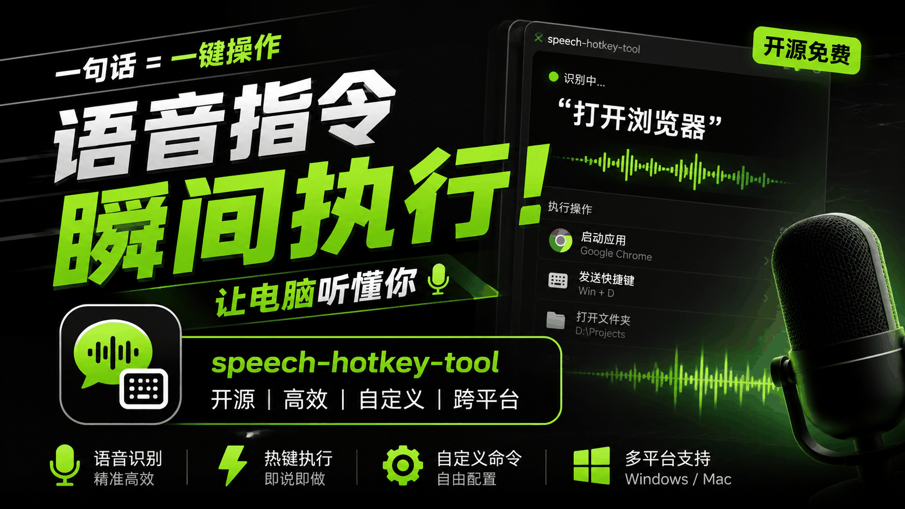

# Speech Hotkey Tool

<p align="center">
  
</p>

<p align="center">
  <a href="#中文">中文</a> | <a href="#english">English</a>
</p>

<p align="center">
  <a href="https://github.com/zeph999/Speech-hotkey-tool/releases/tag/v1.0">Download v1.0</a>
</p>

---

## 中文

> 双击 `Shift` 开始离线听写，停顿后自动识别并粘贴；再双击 `Shift` 停止。

**Speech Hotkey Tool** 是一个 Windows 本地语音输入小工具。它打开后不会显示主窗口，只会常驻在系统托盘中。语音识别完全在本机运行，不上传录音。

> 当前 v1.0 版本仅保证 Windows 10/11 64 位可用。项目图中如出现跨平台字样，属于后续规划，不代表当前版本已经支持 Mac/Linux。

### 演示图

<p align="center">
  
</p>

### 核心特性

- **托盘运行**：双击 `SpeechHotkeyTool.exe` 后，程序只会出现在 Windows 右下角系统托盘。
- **双击 Shift 听写**：双击 `Shift` 开始录音；每次检测到说话停顿，就自动识别当前句子并粘贴到光标所在位置；再双击 `Shift` 停止录音。
- **本地离线识别**：使用 `sherpa-onnx` 加载本地 FunASR 模型，不依赖云端接口。
- **自带模型**：发布包内的 `models` 文件夹已带 `sherpa-onnx-funasr-nano-int8-2025-12-30`，默认 CPU 运行，比较适合不同配置的 Windows 机器。后续会继续加入更多模型。
- **自动粘贴**：识别完成后通过剪贴板和 `Ctrl+V` 自动输入到当前应用。
- **日志反馈**：如果遇到问题，右键托盘图标，点击 `Open Log`，把日志内容反馈给开发者。

### 下载与运行

下载 Release 里的 `SpeechHotkeyToolPortable.zip`，完整解压后目录应类似：

```text
SpeechHotkeyTool.exe
_internal\
models\
README.md
```

直接双击：

```text
SpeechHotkeyTool.exe
```

启动后不会弹出主窗口，只会进入系统托盘。

### 使用方式

第一次启动会加载本地模型，可能需要等待一会儿。把鼠标放到托盘图标上可以查看当前状态。

1. 打开任意可以输入文字的地方，例如记事本、浏览器、聊天窗口、PowerPoint。
2. 把光标放到要输入的位置。
3. 双击 `Shift`，听到提示音后开始说话。
4. 每说完一句稍微停顿一下，程序会自动识别并粘贴。
5. 再双击 `Shift`，停止听写。

### 托盘菜单

右键系统托盘里的图标，可以看到：

- `Start / Stop Dictation`：开始或停止听写。
- `Open Log`：打开日志文件，用于排查问题。
- `Exit`：退出程序。

### 模型说明

当前默认模型：

```text
models\sherpa-onnx-funasr-nano-int8-2025-12-30\
```

这是一个 sherpa-onnx FunASR Nano int8 模型包，默认使用 CPU，线程数为 4。它不是最高精度模型，但体积、速度和兼容性比较均衡，适合拿来作为默认随包模型。

### 常见问题

**Q: 双击 exe 后为什么没有窗口？**  
A: 这是正常的。程序默认是托盘 App，只会出现在 Windows 右下角系统托盘。

**Q: 双击 Shift 没反应怎么办？**  
A: 先确认托盘里有程序图标。如果目标程序是管理员权限运行的，可能需要用管理员权限运行本工具。某些安全软件、游戏或受保护窗口也可能会拦截全局键盘监听。

**Q: 为什么没有自动粘贴？**  
A: 请确认光标已经放在可输入文字的位置。部分管理员权限窗口、游戏、远程桌面或受保护软件可能会拦截模拟粘贴。

**Q: 识别为空怎么办？**  
A: 请检查麦克风权限、默认输入设备、说话音量和环境噪声。也可以右键托盘图标打开日志，把日志内容反馈回来。

**Q: 日志会不会一直变大？**  
A: 不会。日志文件会自动轮转，单个日志最大约 1 MB，最多保留 3 个旧日志。

### 调试命令

如果你不是双击运行，而是在 PowerShell 里调试，可以用：

```powershell
.\run.ps1 --check-model --no-tray --no-preload
```

测试模型自带音频：

```powershell
.\run.ps1 --transcribe-file models\sherpa-onnx-funasr-nano-int8-2025-12-30\test_wavs\dia_hunan.wav --no-tray --no-preload
```

---

## English

> Double-tap `Shift` to start offline dictation. Pause after a sentence, and the recognized text is pasted automatically. Double-tap `Shift` again to stop.

**Speech Hotkey Tool** is a local speech-to-text tray app for Windows. It has no main window after launch; it runs in the system tray. Recognition runs locally on your machine and does not upload audio.

> v1.0 is tested for Windows 10/11 64-bit only. Any cross-platform wording in the promotional image is a future direction, not a current v1.0 promise.

### Demo

<p align="center">
  
</p>

### Features

- **Tray-only app**: after launching `SpeechHotkeyTool.exe`, the app appears only in the Windows system tray.
- **Double-Shift dictation**: double-tap `Shift` to start recording. Each detected pause triggers recognition and pastes the current sentence. Double-tap `Shift` again to stop.
- **Fully local STT**: powered by local `sherpa-onnx` and FunASR models. No cloud API is required.
- **Bundled model**: the portable package includes `models\sherpa-onnx-funasr-nano-int8-2025-12-30`, a CPU-friendly FunASR Nano int8 model that works well across different Windows machines. More models may be added later.
- **Auto paste**: recognized text is pasted into the active input field through the clipboard and `Ctrl+V`.
- **Log for feedback**: if something goes wrong, right-click the tray icon, choose `Open Log`, and send the log for troubleshooting.

### Download And Run

Download `SpeechHotkeyToolPortable.zip` from the Release page and extract it completely. The folder should look like this:

```text
SpeechHotkeyTool.exe
_internal\
models\
README.md
```

Run:

```text
SpeechHotkeyTool.exe
```

The app will not open a main window. It will run in the system tray.

### How To Use

The first launch may take a while because the local model needs to be loaded. Hover over the tray icon to check the current status.

1. Open any text input target, such as Notepad, a browser, a chat window, or PowerPoint.
2. Place the cursor where you want text to appear.
3. Double-tap `Shift` and start speaking after the start sound.
4. Pause briefly after each sentence. The app recognizes and pastes it automatically.
5. Double-tap `Shift` again to stop dictation.

### Tray Menu

Right-click the system tray icon:

- `Start / Stop Dictation`: start or stop dictation.
- `Open Log`: open the log file for troubleshooting.
- `Exit`: quit the app.

### Model

Default model:

```text
models\sherpa-onnx-funasr-nano-int8-2025-12-30\
```

It is a sherpa-onnx FunASR Nano int8 model. The default runtime is CPU with 4 threads. It is not the most accurate model available, but it is a balanced default for size, speed, and compatibility.

### FAQ

**Q: Why is there no window after I run the exe?**  
A: This is expected. The app is a tray app and appears in the Windows system tray.

**Q: Double-tapping Shift does nothing. What should I check?**  
A: Make sure the tray icon is running. If the target app is running as administrator, you may need to run this tool as administrator too. Some security tools, games, or protected windows may block global keyboard hooks.

**Q: Why does auto paste not work?**  
A: Make sure your cursor is in a text input field. Some administrator windows, games, remote desktop sessions, or protected apps may block simulated paste.

**Q: Why is the recognition result empty?**  
A: Check microphone permission, the default input device, speaking volume, and background noise. You can also open the log from the tray menu and send it for troubleshooting.

**Q: Will logs grow forever?**  
A: No. Logs are rotated by size. One log file is about 1 MB, and up to 3 old logs are kept.

### Debug Commands

Validate the model:

```powershell
.\run.ps1 --check-model --no-tray --no-preload
```

Transcribe a bundled test file:

```powershell
.\run.ps1 --transcribe-file models\sherpa-onnx-funasr-nano-int8-2025-12-30\test_wavs\dia_hunan.wav --no-tray --no-preload
```

---

## Credits

- [sherpa-onnx](https://github.com/k2-fsa/sherpa-onnx)
- [FunASR](https://github.com/modelscope/FunASR)
